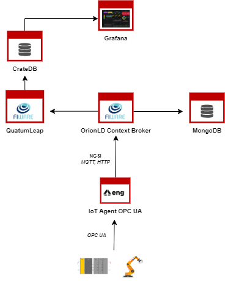

<h1>ARISE PoC</h1>

https://arise-middleware.eu/

 

PoC of all-in-one data management platform that collect and visualize data coming from an OPC UA Server.

<h2>Requirements</h2>
<ul>
    <li>Docker Engine</li>
    <li>Minimum 8GB RAM</li>
    <li>Docker Compose >= 1.29</li>
</ul>

 

<h2>How to run</h2>
<h3>Download the repository:</h3>
<code>git clone https://github.com/Engineering-Research-and-Development/arise-poc.git</code>

<h3>Configure the platform</h3>
<code>Edit docker-compose.yaml file and configure iotagent-opcua according to your OPC UA Server specifications. </code> 
  
For a more complete description on how to configure the IoTAgent, go to <a href="https://github.com/Engineering-Research-and-Development/iotagent-opcua/blob/master/docs/howto.md">IotAgent OPCUA how-to</a>

 
<code>If any change is made to the mapping configuration, edit the subscription configuration of QuantumLeap accordingly, going to conf/quantumleap/subscription/subscription-ld.yaml</code>

<h3>Build & Run containers:</h3>

<code>docker-compose up --build -d</code>

 

<h3>Access the UIs</h3>

1. Grafana at (https://localhost:3000)
2. Default credentials are: admin/admin

 

For more information you can use the following [link](https://github.com/Engineering-Research-and-Development/arise-poc/blob/main/docs/ARISE_PoC_Tutorial_Extended.md)
