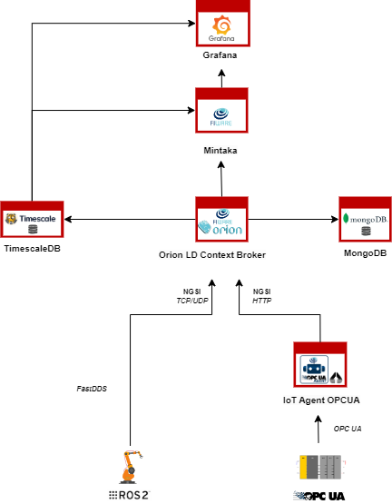
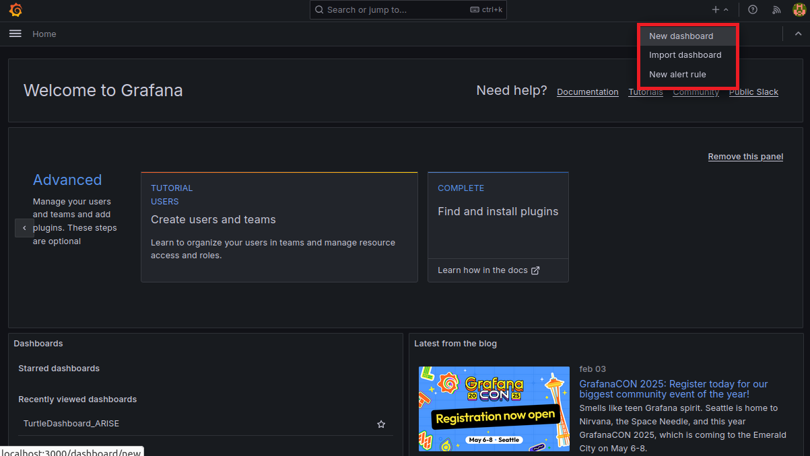
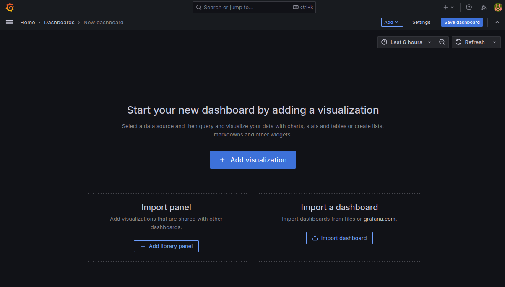
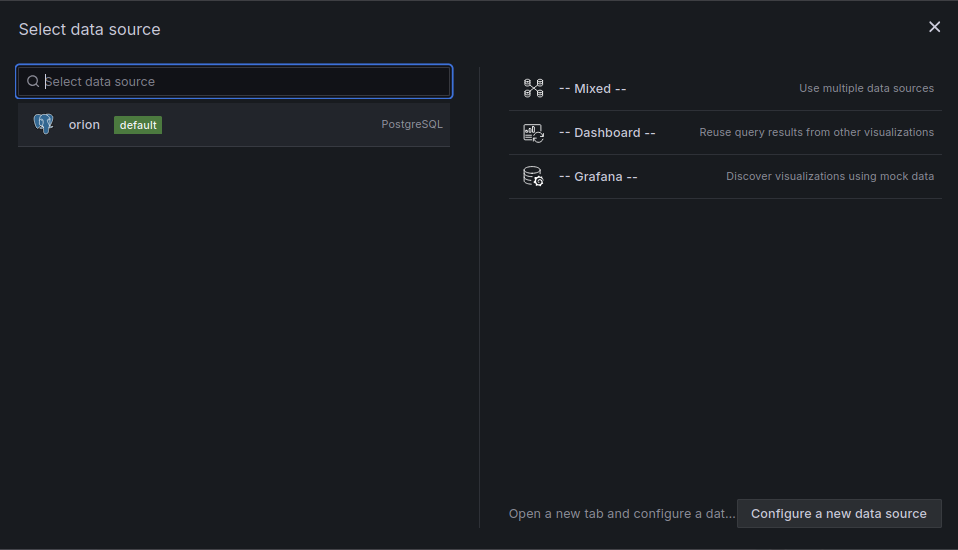
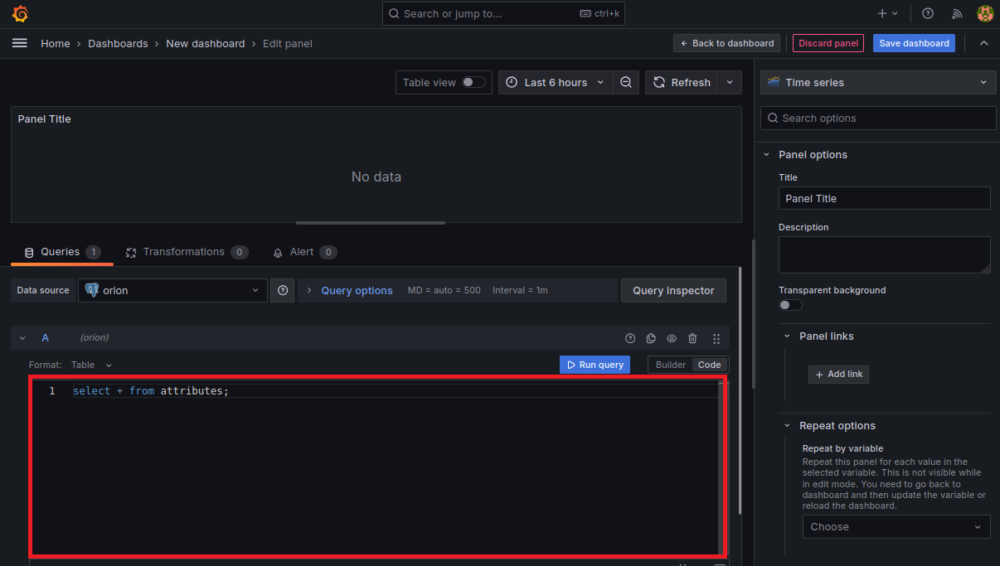
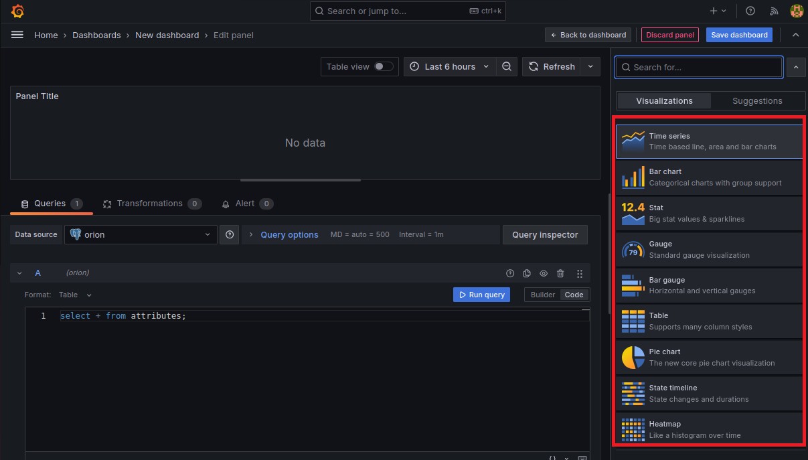
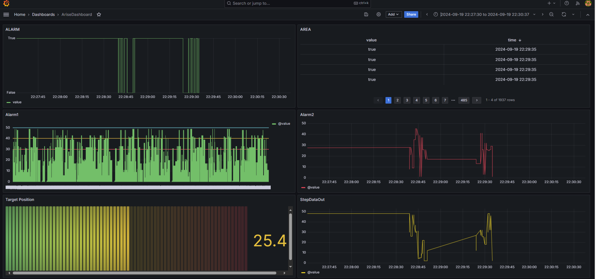
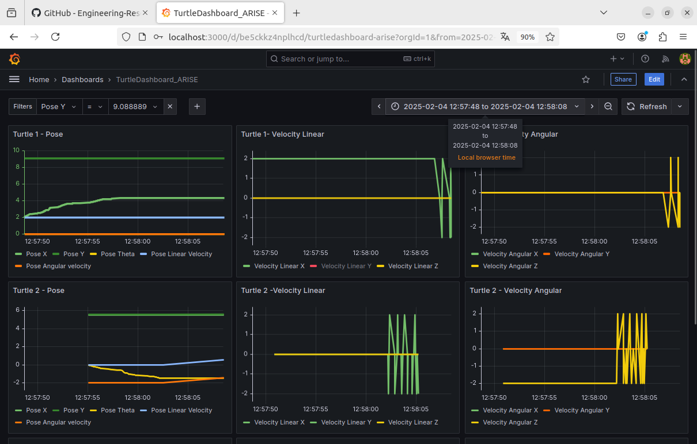

&nbsp;&nbsp;&nbsp;&nbsp;&nbsp;&nbsp;&nbsp;&nbsp;


[](https://www.fiware.org/developers)&nbsp;&nbsp;&nbsp;&nbsp;&nbsp;&nbsp;&nbsp;&nbsp;[](https://opcfoundation.org/)

# ARISE PoC Guide
The ARISE Proof of Concept (PoC) is a FIWARE-based Minimum Viable Platform (MVP) composed of various Docker containers, which encapsulate the application code along with all its dependencies to ensure it runs consistently and reliably across different computing environments.
This containerized approach simplifies deployment, eliminates dependency conflicts, and provides a scalable platform for testing and validation.

This tutorial is a step-by-step guide that demonstrates how to set up the necessary components and workflows, in order to enable the ARISE PoC to connect seamlessly with various information sources. It also provides the means to test a wide range of use cases (UCs) defined and implemented in the Test and Experimentation Facilities (TEFs). 

<p align="center">
  
</p>
## Actors

The actors involved in the scenario are:

-   **OPC UA Server**, represents the data source utilized by the TEF.
-   **Iot Agent OPC UA**, the connector through which to join the industrial environment to this FIWARE-based platform can be configured as described in the
[user guide](https://github.com/Engineering-Research-and-Development/iotagent-opcua/blob/master/docs/user_and_programmers_manual.md).
In order to start working with the above mentioned OPC UA server, configuration files have been already edited and made
available in the _conf_ folder.
-   **ROS2/FastDDS**, this connector implements both an Application Programming Interface (API) and a communication protocol that deploys a Data-Centric Publisher-Subscriber (DCPS) model, with the purpose of establishing efficient and reliable information distribution among Real-Time Systems.
-   **Orion LD Context Broker**, is the entry point of each FIWARE platform that adopts the NGSI LD data model. It can be external, however, 
in order to ensure a self-contained and self-consistent testing environment, it is included in this PoC as part of the Docker Compose setup.
-   **MongoDB**, the database that saves the current state of the data passed through the context broker. It is used by the Orion LD to hold context data information such as data entities, subscriptions and registrations. 
-   **Mintaka**, is a Generic Enabler (GE) of the FIWARE ecosystem designed for time series data storage and management. It serves as a lightweight, scalable API that allows the ingestion, querying, and analysis of historical context information from FIWARE Context Brokers. More information can be found [here](https://github.com/FIWARE/mintaka/blob/main/README.md).
-   **TimescaleDB**,  is a time series database built on PostgreSQL, designed to handle large-scale, time-stamped data efficiently. It offers powerful SQL support for managing time series data, with features like automatic data partitioning, real-time aggregation, and advanced query capabilities. More information can be found [here](https://docs.timescale.com/).
-   **Grafana**, is an open-source analytics and visualization platform that allows users to visualize data stored in TimeScaleDB through customizable dashboards.
It supports data representation using charts, graphs, tables, and alerts. Besides TimeScaleDB, Grafana integrates with a wide range of data sources, including Prometheus, InfluxDB, MySQL, PostgreSQL, Elasticsearch, and more.
It is released under the Apache License 2.0.More information can be found [here](https://grafana.com/).


## Step-by-step Guide

This section outlines the process for rapidly deploying a fully functional testbed that includes all relevant actors.

#### Requirements

-   Docker (Version 26.1.5)
-   Docker-compose (Version 1.29+)
-   RAM 8GB minimum

**Install docker and docker-compose** by following the instructions available on the official web site:

-   Docker: [here](https://docs.docker.com/install/linux/docker-ce/ubuntu/)
-   Docker-Compose: [here](https://docs.docker.com/compose/install/)

**Verify Installation**: Run the following commands to check Docker and Docker Compose:

```bash
docker --version
docker-compose --version
```

#### Step 1 - Clone the ARISE PoC 

Open a terminal and move into a folder in which to create the new folder containing the ARISE PoC components.

Then run:

```bash
git clone "https://github.com/Engineering-Research-and-Development/arise-poc.git"
```

#### Step 2 - Configure the ARISE PoC  
Before launching the ARISE PoC, it is essential to edit the docker-compose.yaml file and configure Iot Agent OPC UA service to align with your specific OPC UA Server's specifications.

```bash
cd arise-poc/
nano docker-compose.yaml
``` 
Here are some environment variables that must be configured:
- IOTA_CB_SERVICE allows to define where the OPCUA IoT Agent sends NGSI-LD context data;
- IOTA_SERVICE defines the devices are registered;
- IOTA_OPCUA_ENDPOINT is used in FIWARE IoT Agent for OPC UA to specify the OPC UA server endpoint.

For a more complete description on how to configure the IoT Agent, go to [link](https://github.com/Engineering-Research-and-Development/iotagent-opcua/blob/master/docs/howto.md).

#### Step 3 - Build & Run the ARISE PoC 

To launch the whole project:

```bash
docker compose up --build -d
```

After that you can run: ****

```bash
docker ps
```

to check if all the required components are running.

(../docs/images/ARISE_PoC_Container.png)

Before starting the ROS2 demo, as X11 session owners, other users must be allowed to use the X Window System (to show the turtles on screen). For that, the following command is executed:

```bash
xhost local:root
```
When the dockers have started, connect to bash in the container of ros2:
```
docker exec -ti ros2 bash
```

Now the TurtleSim and the Keyboard controller can be started:

```bash
source /ros2-ws/install/setup.bash

# Show the turtles on the screen
ros2 run docs_turtlesim turtlesim_node_keys &

# Keyboard controller to move the turtles.
ros2 run docs_turtlesim turtlesim_multi_control 
```
<p align="center">
  
</p>

#### Step 4 - Access the Grafana Dashboard 

In the context of the ARISE PoC, Grafana is used to visualize and analyze the data collected from OPC UA and ROS2 devices, offering an intuitive interface to monitor the performance, and trends of connected systems.
This tool plays a critical role in helping users test various use cases by providing a clear view of the data flow and operational metrics. Grafana is distributed under the Apache License 2.0, ensuring that it is free to use, modify, and distribute.
Its active open-source community and extensive documentation make it accessible to users of all expertise levels. 
For more details, including installation guides, plugins, and advanced configuration options, visit the official Grafana website at https://grafana.com/.

For this PoC, Grafana is accessible at the link https://localhost:3000 using the default credentials admin/admin

#### Configuring a DataSource
In Grafana the Timescale datasource can be configured using the datasources.yaml file, which is part of Grafana's provisioning system. 
This allows for automated setup and consistent configuration of the datasource when Grafana starts. 
TimescaleDB, a powerful time-series database built on PostgreSQL, integrates seamlessly with Grafana, enabling efficient visualization of time-series data.

To configure the TimescaleDB datasource follows these steps:

```bash
cd arise-poc\conf\grafana\datasources 
nano datasources.yaml
```

<p align="center">
  
</p>


When the ARISE PoC is executed, this datasource.yaml file is mounted into the Grafana's provisioning folder to ensure proper configuration and access to the necessary data sources.

#### Creating a new Dashboard
Creating a new dashboard in Grafana allows you to visualize and analyze your data effectively. Here's a step-by-step guide to help you set up a new dashboard:
-Log in Grafana instance and click on the "+" icon in the top right menu, selecting "New Dashboard";

<p align="center">
  
</p>


- Click on "Add a new panel" and in the Query section, choose your data source. 
<p align="center">
  
</p>

<p align="center">
  
</p>


- Construct your query to fetch the desired data, selecting the appropriate visualization type (e.g., graph, table, gauge) from the options.

<p align="center">
  
</p>

<p align="center">
  
</p>


-To configure Panel Settings, you adjust the visualization settings such  axes, legends, and thresholds
-Save the Panel and the Dashboard


#### Sample Dashboard in ARISE PoC 
For the ARISE Proof of Concept (PoC) solution, example dashboards have been developed to graphically represent data from both OPC UA devices and ROS2 devices.


**Sample dashboard for data from an OPCUA device**
 As shown in the figure, this sample dashboard is based on some of the data produced by an OPCUA device provided by TEF of Cartif for the ARISE research project. Specifically, the following parameters have been selected and represented from the entity implemented on the device: ALARM, Alarm1, Alarm2, Area, Target Position, and Step Data Out.
 


**Sample dashboard for data from an ROS2 device**
This sample dashboard represents the data of the entity defined in a ROS2 device. Specifically, for the ARISE research project, three TURTLESIM instances have been implemented as ROS2 devices, and for each of them, the following data is represented:

-**Turtle Pose**: This includes the turtle's linear velocity, its position coordinates (X and Y), and the orientation angle (Theta). These parameters provide crucial information about the turtle's current location and direction of movement in the coordinate system.

-**Turtle Linear Velocity**: This metric indicates the speed at which the turtle is moving in a straight line. It is essential for understanding the turtle's movement dynamics and can be visualized as a gauge or graph, showing real-time changes in speed.

-**Turtle Angular Velocity**: This metric represents the speed of rotation around the Z-axis. Angular velocity is critical for analyzing how quickly the turtle can change its direction, which is particularly important in dynamic environments or when navigating complex paths.

By visualizing these parameters on the dashboard, users can monitor the performance and behavior of the TURTLESIM devices in real-time. The dashboard facilitates a comprehensive overview of the turtles' movements, allowing for effective analysis and decision-making during experiments. 




## Appendices

#### Start IoT Agent OPC UA initialization

For the IoT Agent OPC UA to work an **initialization** phase is required. During this phase the IoT Agent becomes aware of what variables and methods are available on OPC UA server-side. These information can be provided to the agent by means of a configuration file (config.js) or through the REST API

Three different initialization modalities are available:

-   `auto`: invoke a mapping tool responsible of automatically building the mapping between OPC UA and NGSI
-   `static`: use a preloaded config.js
-   `dynamic`: use the REST API

Using the 'auto' mode  in the TEF1 of the ARISE project,  the initialization phase allowed us to define a mapping tool as follows:

```bash
{
     types: {
        Device: {
            active: [
                {
                    name: "Clock05Hz",
                    type: "Boolean"
                },
                {
                    name: "Icon",
                    type: "ByteString"
                },
                {
                    name: "StepDataOut",
                    type: "Byte"
                },
                {
                    name: "StateBits",
                    type: "Byte"
                },
                {
                    name: "ReadyFlag",
                    type: "Boolean"
                },
                {
                    name: "CurrentPosition",
                    type: "Float"
                },
                {
                    name: "CurrentSpeed",
                    type: "Int16"
                },
                {
                    name: "PushingForce",
                    type: "Int16"
                },
                {
                    name: "TargetPosition1",
                    type: "Float"
                },
                {
                    name: "Alarm1",
                    type: "Byte"
                },
                {
                    name: "Alarm2",
                    type: "Byte"
                },
                {
                    name: "Alarm3",
                    type: "Byte"
                },
                {
                    name: "Alarm4",
                    type: "Byte"
                },
                {
                    name: "BUSY",
                    type: "Boolean"
                },
                {
                    name: "SVRE",
                    type: "Boolean"
                },
                {
                    name: "SETON",
                    type: "Boolean"
                },
                {
                    name: "INP",
                    type: "Boolean"
                },
                {
                    name: "AREA",
                    type: "Boolean"
                },
                {
                    name: "WAREA",
                    type: "Boolean"
                },
                {
                    name: "ESTOP",
                    type: "Boolean"
                },
                {
                    name: "ALARM",
                    type: "Boolean"
                },
                {
                    name: "Search0",
                    type: "Boolean"
                }
            ],
            lazy: [],
            commands: [
                {
                    name: "plc_maestro",
                    type: "command"
                
                }
            ]
        }
    },
    contexts: [
        {
            id: "urn:ngsi-ld:Device:servidor_1DBRVC",
            type: "Device",
            mappings: [
                {
                    ocb_id: "Clock05Hz",
                    opcua_id: "ns=4;i=23",
                    object_id: "ns=4;i=23",
                    inputArguments: []
                },
                {
                    ocb_id: "Icon",
                    opcua_id: "ns=3;i=6010",
                    object_id: "ns=3;i=6010",
                    inputArguments: []
                },
                {
                    ocb_id: "StepDataOut",
                    opcua_id: "ns=4;i=3",
                    object_id: "ns=4;i=3",
                    inputArguments: []
                },
                {
                    ocb_id: "StateBits",
                    opcua_id: "ns=4;i=4",
                    object_id: "ns=4;i=4",
                    inputArguments: []
                },
                {
                    ocb_id: "ReadyFlag",
                    opcua_id: "ns=4;i=5",
                    object_id: "ns=4;i=5",
                    inputArguments: []
                },
                {
                    ocb_id: "CurrentPosition",
                    opcua_id: "ns=4;i=6",
                    object_id: "ns=4;i=6",
                    inputArguments: []
                },
                {
                    ocb_id: "CurrentSpeed",
                    opcua_id: "ns=4;i=7",
                    object_id: "ns=4;i=7",
                    inputArguments: []
                },
                {
                    ocb_id: "PushingForce",
                    opcua_id: "ns=4;i=8",
                    object_id: "ns=4;i=8",
                    inputArguments: []
                },
                {
                    ocb_id: "TargetPosition1",
                    opcua_id: "ns=4;i=9",
                    object_id: "ns=4;i=9",
                    inputArguments: []
                },
                {
                    ocb_id: "Alarm1",
                    opcua_id: "ns=4;i=10",
                    object_id: "ns=4;i=10",
                    inputArguments: []
                },
                {
                    ocb_id: "Alarm2",
                    opcua_id: "ns=4;i=11",
                    object_id: "ns=4;i=11",
                    inputArguments: []
                },
                {
                    ocb_id: "Alarm3",
                    opcua_id: "ns=4;i=12",
                    object_id: "ns=4;i=12",
                    inputArguments: []
                },
                {
                    ocb_id: "Alarm4",
                    opcua_id: "ns=4;i=13",
                    object_id: "ns=4;i=13",
                    inputArguments: []
                },
                {
                    ocb_id: "BUSY",
                    opcua_id: "ns=4;i=14",
                    object_id: "ns=4;i=14",
                    inputArguments: []
                },
                {
                    ocb_id: "SVRE",
                    opcua_id: "ns=4;i=15",
                    object_id: "ns=4;i=15",
                    inputArguments: []
                },
                {
                    ocb_id: "SETON",
                    opcua_id: "ns=4;i=16",
                    object_id: "ns=4;i=16",
                    inputArguments: []
                },
                {
                    ocb_id: "INP",
                    opcua_id: "ns=4;i=17",
                    object_id: "ns=4;i=17",
                    inputArguments: []
                },
                {
                    ocb_id: "AREA",
                    opcua_id: "ns=4;i=18",
                    object_id: "ns=4;i=18",
                    inputArguments: []
                },
                {
                    ocb_id: "WAREA",
                    opcua_id: "ns=4;i=19",
                    object_id: "ns=4;i=19",
                    inputArguments: []
                },
                {
                    ocb_id: "ESTOP",
                    opcua_id: "ns=4;i=20",
                    object_id: "ns=4;i=20",
                    inputArguments: []
                },
                {
                    ocb_id: "ALARM",
                    opcua_id: "ns=4;i=21",
                    object_id: "ns=4;i=21",
                    inputArguments: []
                },
                {
                    ocb_id: "Search0",
                    opcua_id: "ns=4;i=22",
                    object_id: "ns=4;i=22",
                    inputArguments: []
                }
            ]
        }
    ],
    contextSubscriptions: [
    ]
}
```

####  Monitor Container behaviour

Any activity regarding the container can be monitored looking at the logs. To view docker testbed logs run:

```bash
cd arise-poc/
docker ps
docker logs *CONTAINER_ID*
```

#### How to build the Docker Image

Docker Compose can be downloaded here [docker-compose.yaml](https://github.com/Engineering-Research-and-Development/arise-poc/blob/main/docker-compose.yaml):


Modifying this file you can:

-   Change exposed ports
-   Change extra hosts in iot-agent
-   Change IOTA_OPCUA_ENDPOINT

```yaml
services:
  iot-agent:
    image: iotagent4fiware/iotagent-opcua:2.2.8
    hostname: iotagent-opcua
    depends_on:
      - mongodb
      - orion
    networks:
      - hostnet
    extra_hosts:
      - "my-local-opcua-server:192.168.1.100"
    ports:
      - "4041:4041"
      - "9229:9229"
    environment:
      # Environment variables as before
      - "CONFIGURATION_TYPE=static"
      - "CONFIG_RETRIEVAL=false"
      - "DEFAULT_KEY=iot"
      - "DEFAULT_TRANSPORT=OPCUA"
      - "IOTA_LOGLEVEL=DEBUG"
      - "IOTA_TIMESTAMP=true"
      - "IOTA_CB_HOST=orion"
      - "IOTA_CB_PORT=1026"
      - "IOTA_CB_NGSIVERSION=ld"
      - "IOTA_CB_NGSILDCONTEXT=https://uri.etsi.org/ngsi-ld/v1/ngsi-ld-core-context.jsonld"
      - "IOTA_CB_SERVICE=opcua_server"
      - "IOTA_CB_SUBSERVICE=/demo"
      - "IOTA_NORTH_PORT=4041"
      - "IOTA_REGISTRY_TYPE=mongodb"
      - "IOTA_MONGO_HOST=mongodb"
      - "IOTA_MONGO_PORT=27017"
      - "IOTA_MONGO_DB=iotagent_opcua"
      - "IOTA_SERVICE=opcua_server"
      - "IOTA_SUBSERVICE=/demo"
      - "IOTA_PROVIDER_URL=http://iotagent-opcua:4041"
      - "IOTA_DEVICEREGDURATION=P20Y"
      - "IOTA_DEFAULTTYPE=Device"
      - "IOTA_DEFAULTRESOURCE=/iot/opcua"
      - "IOTA_EXPLICITATTRS=true"
      - "IOTA_EXTENDED_FORBIDDEN_CHARACTERS=[]"
      - "IOTA_AUTOPROVISION=true"
      - "IOTA_EXPRESS_LIMIT=50mb"
      - "IOTA_OPCUA_ENDPOINT=opc.tcp://host.docker.internal:4840/opcua_server"
      - "IOTA_OPCUA_SECURITY_MODE=None" #SignAndEncrypt
      - "IOTA_OPCUA_SECURITY_POLICY=None" #Basic256Sha256
      # - "IOTA_OPCUA_SECURITY_USERNAME=user1"
      # - "IOTA_OPCUA_SECURITY_PASSWORD=test"
      - "IOTA_OPCUA_UNIQUE_SUBSCRIPTION=false"
      - "IOTA_OPCUA_SUBSCRIPTION_NOTIFICATIONS_PER_PUBLISH=1000"
      - "IOTA_OPCUA_SUBSCRIPTION_PUBLISHING_ENABLED=true"
      - "IOTA_OPCUA_SUBSCRIPTION_REQ_LIFETIME_COUNT=100"
      - "IOTA_OPCUA_SUBSCRIPTION_REQ_MAX_KEEP_ALIVE_COUNT=10"
      - "IOTA_OPCUA_SUBSCRIPTION_REQ_PUBLISHING_INTERVAL=1000"
      - "IOTA_OPCUA_SUBSCRIPTION_PRIORITY=128"
      - "IOTA_OPCUA_MT_POLLING=false"
      - "IOTA_OPCUA_MT_AGENT_ID=age01_"
      - "IOTA_OPCUA_MT_ENTITY_ID=age01_Car"
      - "IOTA_OPCUA_MT_ENTITY_TYPE=Device"
      - "IOTA_OPCUA_MT_NAMESPACE_IGNORE=0,7"
      - "IOTA_OPCUA_MT_STORE_OUTPUT=true"
    volumes:
      - ./conf/iotagent-opcua:/opt/iotagent-opcua/conf

  mongodb:
    image: mongo:4.4 #latest
    hostname: mongodb
    networks:
      - hostnet
    ports:
      - "27017:27017"
    command: --bind_ip_all 
    volumes:
      - mongodb:/data

  orion:
    image: fiware/orion-ld:1.8.0-PRE-1646
    hostname: orion
    privileged: true
    ipc: host
    depends_on:
      - mongodb
    networks:
      - hostnet
    ports:
      - "1026:1026"
    restart: always
    command: -dbhost mongodb -logLevel DEBUG -wip dds -mongocOnly # -forwarding -experimental
    volumes:
       - ./conf/orionld/config-dds.json:/root/.orionld
    healthcheck:
      test: curl --fail -s http://orion:1026/version || exit 1
      interval: 30s
      retries: 15

  ros2:
    image: ros2
    hostname: ros2
    container_name: ros2
    privileged: true
    ipc: host
    networks:
      - hostnet
    environment:
      DISPLAY: ":0.0"
    volumes:
       - /tmp/.X11-unix:/tmp/.X11-unix

  timescale:
    image: timescale/timescaledb-postgis:1.7.5-pg12
    hostname: timescale
    networks:
      - hostnet
    ports:
      - "5432:5432"  
    environment:
      - POSTGRES_USER=orion
      - POSTGRES_PASSWORD=orion
      - POSTGRES_HOST_AUTH_METHOD=trust
    command: ["postgres", "-c", "log_statement=all"]
    healthcheck:
      test: [ "CMD-SHELL", "pg_isready -U orion" ]
      interval: 15s
      timeout: 15s
      retries: 5
      start_period: 60s

  mintaka:
    image: fiware/mintaka:0.4.3
    hostname: mintaka
    restart: always
    networks:
      - hostnet 
    ports:
      - "8080:8080"
    environment:
      - MICRONAUT_SERVER_PORT=8080
      - MICRONAUT_METRICS_ENABLED=true
      - ENDPOINTS_ALL_PORT=8080
      - ENDPOINTS_METRICS_ENABLED=true
      - ENDPOINTS_HEALTH_ENABLED=true
      - DATASOURCES_DEFAULT_HOST=timescale
      - DATASOURCES_DEFAULT_PORT=5432
      - DATASOURCES_DEFAULT_USERNAME=orion
      - DATASOURCES_DEFAULT_PASSWORD=orion
      - DATASOURCES_DEFAULT_DATABASE=orion
      - LOGGERS_LEVELS_ROOT=DEBUG

  grafana:
    image: grafana/grafana:latest
    hostname: grafana
    networks:
      - hostnet
    ports:
      - 3000:3000  
    environment:
      - GF_INSTALL-PLUGINS=yesoreyeram-infinity-datasource
    volumes:
      - ./conf/grafana/dashboard.yaml:/etc/grafana/provisioning/dashboards/main.yaml
      - ./conf/grafana/datasources:/etc/grafana/provisioning/datasources
      - ./conf/grafana/alerting:/etc/grafana/provisioning/alerting
      - ./conf/grafana/dashboards:/var/lib/grafana/dashboards

  
volumes:
  mongodb: ~

networks:
  hostnet:
    driver: bridge
```
