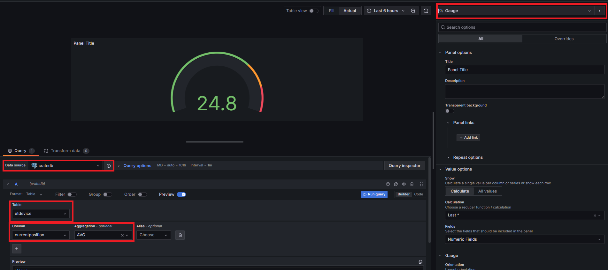
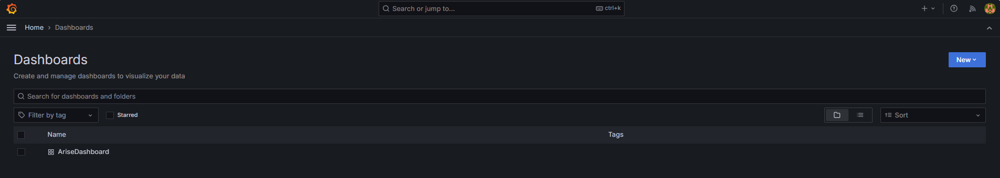
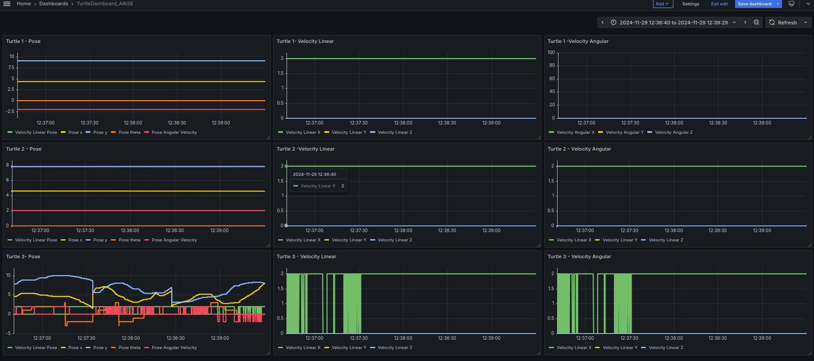

&nbsp;&nbsp;&nbsp;&nbsp;&nbsp;&nbsp;&nbsp;&nbsp;


[](https://www.fiware.org/developers)&nbsp;&nbsp;&nbsp;&nbsp;&nbsp;&nbsp;&nbsp;&nbsp;[](https://opcfoundation.org/)

# ARISE PoC Tutorial
The ARISE PoC solution is created using Docker containers that packages up code and all its dependencies so the application runs quickly and reliably from one computing environment to another. 

This is a step-by-step tutorial that will introduce in detail how to enable ARISE PoC connecting different information sources as OPC UA devices with which to test several UCs originated by the TEFs.


## Actors

The actors involved in the scenario are:

-   **OPC UA Server**, representing the data source utilized by TEF
-   **Iot Agent OPC UA**, the connector to join industrial environment to FIWARE can be configured as described in the
[user guide](https://github.com/Engineering-Research-and-Development/iotagent-opcua/blob/master/docs/user_and_programmers_manual.md).
In order to start playing with the above mentioned OPC UA server, configuration files have been already edited and
available in _conf_ folder.
-   **Orion LD Context Broker**, the broker as entry point of FIWARE platform using NGSI LD data model. Orion LD Context Broker can be external, however to have a black box for testing, it will be included in docker compose in
order to have a self-supporting environment.
-   **MongoDB**, the database that saves the current state of the data passed through the OCB. It is used by the Orion LD Context Broker to hold context data information such as data entities, subscriptions and registrations. 
-   **Mintaka**, The GE Mintaka is a Generic Enabler (GE) of the FIWARE ecosystem designed for time series data storage and management. It serves as a lightweight, scalable API that allows the ingestion, querying, and analysis of historical context information from FIWARE Context Brokers. More information can be found [here](https://github.com/FIWARE/mintaka/blob/main/README.md).
-   **TimescaleDB**,  is a time series database built on PostgreSQL, designed to handle large-scale, time-stamped data efficiently. It offers powerful SQL support for managing time series data, with features like automatic data partitioning, real-time aggregation, and advanced query capabilities. More information can be found [here](https://docs.timescale.com/).
-   **Grafana**, visualize data stored in CrateDB, using user-defined dashboards.Grafana is an open source software for time series analytics tool which will be used during this tutorial. It integrates with a variety of time-series databases including CrateDB. It is available licensed under the Apache License 2.0. More information can be found [here](https://grafana.com/).


## Step-by-step Tutorial

In this paragraph we are going to describe how to quickly deploy a working testbed consisting of all the actors.

#### Requirements

-   Docker (Version 26.1.5)
-   Docker-compose (Version 1.29+)
-   RAM 8GB minimum

Install docker and docker-compose by following the instructions available on the official web site:

-   Docker: [here](https://docs.docker.com/install/linux/docker-ce/ubuntu/)
-   Docker-Compose: [here](https://docs.docker.com/compose/install/)

Once docker has been correctly installed you can continue with the other steps

#### Step 1 - Clone the ARISE PoC

Open a terminal and move into a folder in which to create the new folder containing the ARISE PoC

Then run:

```bash
git clone "https://github.com/Engineering-Research-and-Development/arise-poc.git"
```

#### Step 2 - Configure the platform 
Before launching the application you need to edit the docker-compose.yaml file and configure Iot  Agent OPC UA according to your OPC UA Server specifications. 

```bash
cd arise-poc/
nano docker-compose.yaml
``` 

For a more complete description on how to configure the IoT Agent, go to [link](https://github.com/Engineering-Research-and-Development/iotagent-opcua/blob/master/docs/howto.md).

If any change is made to the mapping configuration, edit the subscription configuration of QuantumLeap accordingly, going to conf/quantumleap/subscription/subscription-ld.yaml

#### Step 3 - Build & Run Platform

To launch the whole project:

```bash
docker-compose up --build -d
```

After that you can run:

```bash
docker ps
```

to check if all the required components are running.

When the dockers have started, connect to bash in the container of ros2:
```
docker exec -ti ros2 bash
```

Now the TurtleSim and the Keyboard controller can be started:

```
source /ros2-ws/install/setup.bash

# Show the turtles on the screen
ros2 run docs_turtlesim turtlesim_node_keys &

# Keyboard controller to move the turtles.
ros2 run docs_turtlesim turtlesim_multi_control 
```

#### Step 4 - Access the Grafana Dashboard / CrateDB
The UI part of the ARISE PoC is defined using Grafana that is an open source software for time series analytics tool which will be used during this tutorial. It integrates with a variety of time-series databases including CrateDB. It is available licensed under the Apache License 2.0. More information can be found at https://grafana.com/.

Grafana is accessible at the link https://localhost:3000 using the default credentials admin/admin

#### Configuring a DataSource
In Grafana the PostgreSQL Datasource is configured using the  datasources.yaml file in 

```bash
cd arise-poc\conf\grafana\datasources 
nano datasources.yaml
```


#### Configuring a Dashboard
To display a new dashboard, you can either click the + button and select Dashboard or go directly to http://localhost:3000/dashboard/new?orgId=1. Thereafter, click Add Query.
Clicking the new Dashboard, you can select the Data Source, the table, the column, any types of data aggregations and the type of chart to represent the selected attribute as shown in the figure



In ARISE PoC, Dashboards based on the OPCUA device of the TEF1 of Cartif are defined, as shown in the figure. 






## Appendices

#### Start IoT Agent OPC UA initialization

For the IoT Agent OPC UA to work an **initialization** phase is required. During this phase the IoT Agent becomes aware of what variables and methods are available on OPC UA server-side. These information can be provided to the agent by means of a configuration file (config.js) or through the REST API

Three different initialization modalities are available:

-   `auto`: invoke a mapping tool responsible of automatically building the mapping between OPC UA and NGSI
-   `static`: use a preloaded config.js
-   `dynamic`: use the REST API

Using the 'auto' mode  in the TEF1 of the ARISE project,  the initialization phase allowed us to define a mapping tool as follows:

```bash
{
     types: {
        Device: {
            active: [
                {
                    name: "Clock05Hz",
                    type: "Boolean"
                },
                {
                    name: "Icon",
                    type: "ByteString"
                },
                {
                    name: "StepDataOut",
                    type: "Byte"
                },
                {
                    name: "StateBits",
                    type: "Byte"
                },
                {
                    name: "ReadyFlag",
                    type: "Boolean"
                },
                {
                    name: "CurrentPosition",
                    type: "Float"
                },
                {
                    name: "CurrentSpeed",
                    type: "Int16"
                },
                {
                    name: "PushingForce",
                    type: "Int16"
                },
                {
                    name: "TargetPosition1",
                    type: "Float"
                },
                {
                    name: "Alarm1",
                    type: "Byte"
                },
                {
                    name: "Alarm2",
                    type: "Byte"
                },
                {
                    name: "Alarm3",
                    type: "Byte"
                },
                {
                    name: "Alarm4",
                    type: "Byte"
                },
                {
                    name: "BUSY",
                    type: "Boolean"
                },
                {
                    name: "SVRE",
                    type: "Boolean"
                },
                {
                    name: "SETON",
                    type: "Boolean"
                },
                {
                    name: "INP",
                    type: "Boolean"
                },
                {
                    name: "AREA",
                    type: "Boolean"
                },
                {
                    name: "WAREA",
                    type: "Boolean"
                },
                {
                    name: "ESTOP",
                    type: "Boolean"
                },
                {
                    name: "ALARM",
                    type: "Boolean"
                },
                {
                    name: "Search0",
                    type: "Boolean"
                }
            ],
            lazy: [],
            commands: [
                {
                    name: "plc_maestro",
                    type: "command"
                
                }
            ]
        }
    },
    contexts: [
        {
            id: "urn:ngsi-ld:Device:servidor_1DBRVC",
            type: "Device",
            mappings: [
                {
                    ocb_id: "Clock05Hz",
                    opcua_id: "ns=4;i=23",
                    object_id: "ns=4;i=23",
                    inputArguments: []
                },
                {
                    ocb_id: "Icon",
                    opcua_id: "ns=3;i=6010",
                    object_id: "ns=3;i=6010",
                    inputArguments: []
                },
                {
                    ocb_id: "StepDataOut",
                    opcua_id: "ns=4;i=3",
                    object_id: "ns=4;i=3",
                    inputArguments: []
                },
                {
                    ocb_id: "StateBits",
                    opcua_id: "ns=4;i=4",
                    object_id: "ns=4;i=4",
                    inputArguments: []
                },
                {
                    ocb_id: "ReadyFlag",
                    opcua_id: "ns=4;i=5",
                    object_id: "ns=4;i=5",
                    inputArguments: []
                },
                {
                    ocb_id: "CurrentPosition",
                    opcua_id: "ns=4;i=6",
                    object_id: "ns=4;i=6",
                    inputArguments: []
                },
                {
                    ocb_id: "CurrentSpeed",
                    opcua_id: "ns=4;i=7",
                    object_id: "ns=4;i=7",
                    inputArguments: []
                },
                {
                    ocb_id: "PushingForce",
                    opcua_id: "ns=4;i=8",
                    object_id: "ns=4;i=8",
                    inputArguments: []
                },
                {
                    ocb_id: "TargetPosition1",
                    opcua_id: "ns=4;i=9",
                    object_id: "ns=4;i=9",
                    inputArguments: []
                },
                {
                    ocb_id: "Alarm1",
                    opcua_id: "ns=4;i=10",
                    object_id: "ns=4;i=10",
                    inputArguments: []
                },
                {
                    ocb_id: "Alarm2",
                    opcua_id: "ns=4;i=11",
                    object_id: "ns=4;i=11",
                    inputArguments: []
                },
                {
                    ocb_id: "Alarm3",
                    opcua_id: "ns=4;i=12",
                    object_id: "ns=4;i=12",
                    inputArguments: []
                },
                {
                    ocb_id: "Alarm4",
                    opcua_id: "ns=4;i=13",
                    object_id: "ns=4;i=13",
                    inputArguments: []
                },
                {
                    ocb_id: "BUSY",
                    opcua_id: "ns=4;i=14",
                    object_id: "ns=4;i=14",
                    inputArguments: []
                },
                {
                    ocb_id: "SVRE",
                    opcua_id: "ns=4;i=15",
                    object_id: "ns=4;i=15",
                    inputArguments: []
                },
                {
                    ocb_id: "SETON",
                    opcua_id: "ns=4;i=16",
                    object_id: "ns=4;i=16",
                    inputArguments: []
                },
                {
                    ocb_id: "INP",
                    opcua_id: "ns=4;i=17",
                    object_id: "ns=4;i=17",
                    inputArguments: []
                },
                {
                    ocb_id: "AREA",
                    opcua_id: "ns=4;i=18",
                    object_id: "ns=4;i=18",
                    inputArguments: []
                },
                {
                    ocb_id: "WAREA",
                    opcua_id: "ns=4;i=19",
                    object_id: "ns=4;i=19",
                    inputArguments: []
                },
                {
                    ocb_id: "ESTOP",
                    opcua_id: "ns=4;i=20",
                    object_id: "ns=4;i=20",
                    inputArguments: []
                },
                {
                    ocb_id: "ALARM",
                    opcua_id: "ns=4;i=21",
                    object_id: "ns=4;i=21",
                    inputArguments: []
                },
                {
                    ocb_id: "Search0",
                    opcua_id: "ns=4;i=22",
                    object_id: "ns=4;i=22",
                    inputArguments: []
                }
            ]
        }
    ],
    contextSubscriptions: [
    ]
}
```

####  Monitor Container behaviour

Any activity regarding the container can be monitored looking at the logs. To view docker testbed logs run:

```bash
cd arise-poc/
docker ps
docker logs *CONTAINER_ID*
```

#### How to build the Docker Image

Docker Compose can be downloaded here [docker-compose.yaml](https://github.com/Engineering-Research-and-Development/arise-poc/blob/main/docker-compose.yaml):


Modifying this file you can:

-   Change exposed ports
-   Change extra hosts in iot-agent
-   Change IOTA_OPCUA_ENDPOINT

```yaml
services:
  iot-agent:
    image: iotagent4fiware/iotagent-opcua:2.2.8
    hostname: iotagent-opcua
    depends_on:
      - mongodb
      - orion
    networks:
      - hostnet
    extra_hosts:
      - "my-local-opcua-server:192.168.1.100"
    ports:
      - "4041:4041"
      - "9229:9229"
    environment:
      # Environment variables as before
      - "CONFIGURATION_TYPE=static"
      - "CONFIG_RETRIEVAL=false"
      - "DEFAULT_KEY=iot"
      - "DEFAULT_TRANSPORT=OPCUA"
      - "IOTA_LOGLEVEL=DEBUG"
      - "IOTA_TIMESTAMP=true"
      - "IOTA_CB_HOST=orion"
      - "IOTA_CB_PORT=1026"
      - "IOTA_CB_NGSIVERSION=ld"
      - "IOTA_CB_NGSILDCONTEXT=https://uri.etsi.org/ngsi-ld/v1/ngsi-ld-core-context.jsonld"
      - "IOTA_CB_SERVICE=opcua_server"
      - "IOTA_CB_SUBSERVICE=/demo"
      - "IOTA_NORTH_PORT=4041"
      - "IOTA_REGISTRY_TYPE=mongodb"
      - "IOTA_MONGO_HOST=mongodb"
      - "IOTA_MONGO_PORT=27017"
      - "IOTA_MONGO_DB=iotagent_opcua"
      - "IOTA_SERVICE=opcua_server"
      - "IOTA_SUBSERVICE=/demo"
      - "IOTA_PROVIDER_URL=http://iotagent-opcua:4041"
      - "IOTA_DEVICEREGDURATION=P20Y"
      - "IOTA_DEFAULTTYPE=Device"
      - "IOTA_DEFAULTRESOURCE=/iot/opcua"
      - "IOTA_EXPLICITATTRS=true"
      - "IOTA_EXTENDED_FORBIDDEN_CHARACTERS=[]"
      - "IOTA_AUTOPROVISION=true"
      - "IOTA_EXPRESS_LIMIT=50mb"
      - "IOTA_OPCUA_ENDPOINT=opc.tcp://host.docker.internal:4840/opcua_server"
      - "IOTA_OPCUA_SECURITY_MODE=None" #SignAndEncrypt
      - "IOTA_OPCUA_SECURITY_POLICY=None" #Basic256Sha256
      # - "IOTA_OPCUA_SECURITY_USERNAME=user1"
      # - "IOTA_OPCUA_SECURITY_PASSWORD=test"
      - "IOTA_OPCUA_UNIQUE_SUBSCRIPTION=false"
      - "IOTA_OPCUA_SUBSCRIPTION_NOTIFICATIONS_PER_PUBLISH=1000"
      - "IOTA_OPCUA_SUBSCRIPTION_PUBLISHING_ENABLED=true"
      - "IOTA_OPCUA_SUBSCRIPTION_REQ_LIFETIME_COUNT=100"
      - "IOTA_OPCUA_SUBSCRIPTION_REQ_MAX_KEEP_ALIVE_COUNT=10"
      - "IOTA_OPCUA_SUBSCRIPTION_REQ_PUBLISHING_INTERVAL=1000"
      - "IOTA_OPCUA_SUBSCRIPTION_PRIORITY=128"
      - "IOTA_OPCUA_MT_POLLING=false"
      - "IOTA_OPCUA_MT_AGENT_ID=age01_"
      - "IOTA_OPCUA_MT_ENTITY_ID=age01_Car"
      - "IOTA_OPCUA_MT_ENTITY_TYPE=Device"
      - "IOTA_OPCUA_MT_NAMESPACE_IGNORE=0,7"
      - "IOTA_OPCUA_MT_STORE_OUTPUT=true"
    volumes:
      - ./conf/iotagent-opcua:/opt/iotagent-opcua/conf

  mongodb:
    image: mongo:4.4 #latest
    hostname: mongodb
    networks:
      - hostnet
    ports:
      - "27017:27017"
    command: --bind_ip_all 
    volumes:
      - mongodb:/data

  orion:
    image: fiware/orion-ld:1.8.0-PRE-1646
    hostname: orion
    privileged: true
    ipc: host
    depends_on:
      - mongodb
    networks:
      - hostnet
    ports:
      - "1026:1026"
    restart: always
    command: -dbhost mongodb -logLevel DEBUG -wip dds -mongocOnly # -forwarding -experimental
    volumes:
       - ./conf/orionld/config-dds.json:/root/.orionld
    healthcheck:
      test: curl --fail -s http://orion:1026/version || exit 1
      interval: 30s
      retries: 15

  ros2:
    image: ros2
    hostname: ros2
    container_name: ros2
    privileged: true
    ipc: host
    networks:
      - hostnet
    environment:
      DISPLAY: ":0.0"
    volumes:
       - /tmp/.X11-unix:/tmp/.X11-unix

  timescale:
    image: timescale/timescaledb-postgis:1.7.5-pg12
    hostname: timescale
    networks:
      - hostnet
    ports:
      - "5432:5432"  
    environment:
      - POSTGRES_USER=orion
      - POSTGRES_PASSWORD=orion
      - POSTGRES_HOST_AUTH_METHOD=trust
    command: ["postgres", "-c", "log_statement=all"]
    healthcheck:
      test: [ "CMD-SHELL", "pg_isready -U orion" ]
      interval: 15s
      timeout: 15s
      retries: 5
      start_period: 60s

  mintaka:
    image: fiware/mintaka:0.4.3
    hostname: mintaka
    restart: always
    networks:
      - hostnet 
    ports:
      - "8080:8080"
    environment:
      - MICRONAUT_SERVER_PORT=8080
      - MICRONAUT_METRICS_ENABLED=true
      - ENDPOINTS_ALL_PORT=8080
      - ENDPOINTS_METRICS_ENABLED=true
      - ENDPOINTS_HEALTH_ENABLED=true
      - DATASOURCES_DEFAULT_HOST=timescale
      - DATASOURCES_DEFAULT_PORT=5432
      - DATASOURCES_DEFAULT_USERNAME=orion
      - DATASOURCES_DEFAULT_PASSWORD=orion
      - DATASOURCES_DEFAULT_DATABASE=orion
      - LOGGERS_LEVELS_ROOT=DEBUG

  grafana:
    image: grafana/grafana:latest
    hostname: grafana
    networks:
      - hostnet
    ports:
      - 3000:3000  
    environment:
      - GF_INSTALL-PLUGINS=yesoreyeram-infinity-datasource
    volumes:
      - ./conf/grafana/dashboard.yaml:/etc/grafana/provisioning/dashboards/main.yaml
      - ./conf/grafana/datasources:/etc/grafana/provisioning/datasources
      - ./conf/grafana/alerting:/etc/grafana/provisioning/alerting
      - ./conf/grafana/dashboards:/var/lib/grafana/dashboards

  
volumes:
  mongodb: ~

networks:
  hostnet:
    driver: bridge
```
